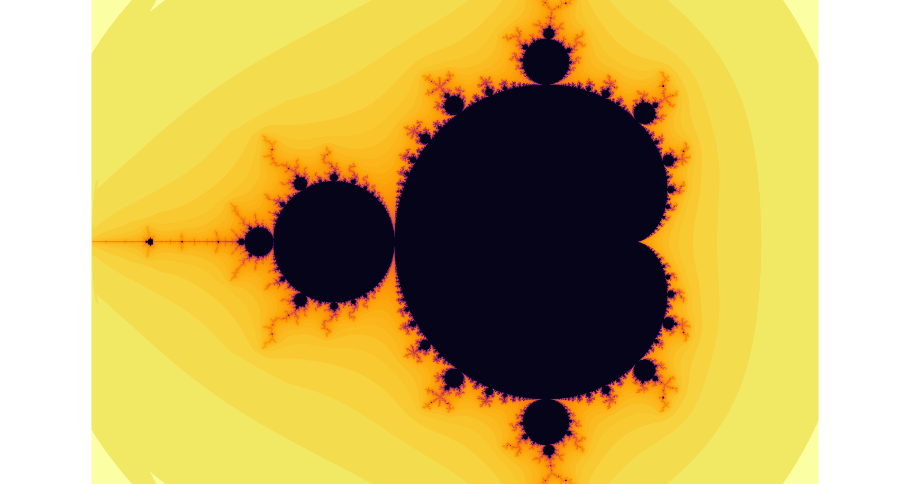

# Mandelbrot Fractal Generator

A high-performance, GPU-accelerated Mandelbrot fractal generator with interactive zooming capabilities. This implementation leverages CUDA through Numba for real-time fractal computation and matplotlib for visualization.



## Features

- **GPU Acceleration**: Utilizes CUDA with Numba JIT compilation for maximum performance
- **Interactive Zooming**: Click anywhere on the fractal to zoom in 10x at that location
- **High Resolution**: Renders at 2000×1334 pixels for detailed visualization
- **Smooth Rendering**: Implements smooth iteration count to reduce visual artifacts
- **Real-time Generation**: Fractals are computed on-the-fly during zoom operations

## Requirements

### Hardware
- NVIDIA GPU with CUDA support
- Sufficient GPU memory for 2000×1334 pixel computations

### Software Dependencies
- Python 3.6+
- NumPy
- Matplotlib
- Numba with CUDA support
- CUDA Toolkit (compatible with your GPU)

## Installation

1. **Clone the repository:**
   ```bash
   git clone https://github.com/CJRockball/Mandelbrot.git
   cd Mandelbrot
   ```

2. **Install dependencies:**
   ```bash
   pip install numpy matplotlib numba
   ```

3. **Ensure CUDA is properly installed:**
   - Install NVIDIA CUDA Toolkit
   - Verify installation: `nvidia-smi`
   - Test Numba CUDA: `python -c "from numba import cuda; print(cuda.gpus)"`

## Usage

### Basic Usage
```bash
python main.py
```

This will open a matplotlib window displaying the Mandelbrot fractal. Click anywhere on the image to zoom in at that location.

### Interactive Controls
- **Left Click**: Zoom in 10x at the clicked location
- **Window Controls**: Use standard matplotlib controls for panning (if needed)
- **Close**: Close the window to exit the program

## Code Structure

### `main.py`
The entry point of the application. Sets initial viewing bounds and orchestrates the fractal generation and display.

### `mandel_calc.py`
Core computational module containing:
- **`mandel()`**: CPU version of the Mandelbrot iteration algorithm
- **`mandel_gpu`**: GPU-compiled version using Numba CUDA JIT
- **`mandel_kernel()`**: CUDA kernel for parallel fractal computation
- **`run_mandel()`**: Main GPU orchestration function
- **`calc_dim()`**: Calculates new viewing bounds for zoom operations

### `plot.py`
Visualization and interaction module featuring:
- **`draw_image_func()`**: Main plotting function with event handling
- **`onevent()`**: Mouse click handler for interactive zooming
- Matplotlib-based rendering with customizable colormaps

## Technical Details

### Performance Specifications
- **Grid Dimensions**: 32×16 blocks
- **Block Dimensions**: 32×8 threads
- **Image Resolution**: 2000×1334 pixels (2.67 megapixels)
- **Maximum Iterations**: 1000
- **Zoom Factor**: 10× per click

### Algorithm Implementation
- **Escape Radius**: 2.0 (standard Mandelbrot criterion)
- **Initial View**: Real axis [-2, 1], Imaginary axis [-1, 1]
- **Smooth Iteration Count**: Implemented to reduce color banding
- **Memory Management**: Efficient GPU memory transfer using Numba CUDA

### Mathematical Foundation
The Mandelbrot set is defined as the set of complex numbers c for which the sequence:
```
z₀ = 0
z_{n+1} = z_n² + c
```
remains bounded. Points are colored based on how quickly the sequence escapes to infinity.

## Customization

### Modifying Parameters
Edit `mandel_calc.py` to adjust:
- **Image resolution**: Change the `gimage` dimensions in `run_mandel()`
- **Iteration count**: Modify `iter_lvl` variable
- **Zoom factor**: Adjust the division factor in `calc_dim()`

### Visual Customization
Edit `plot.py` to change:
- **Colormap**: Modify the `cmap` parameter in `draw_image_func()`
- **Smoothing**: Adjust the `powern` parameter
- **Display options**: Modify matplotlib settings

## Performance Notes

- **First Run**: Initial compilation may take a few seconds due to JIT compilation
- **GPU Memory**: Ensure sufficient VRAM for the image buffer
- **Zoom Depth**: Very deep zooms may encounter floating-point precision limits
- **Performance**: Typical generation time is under 1 second on modern GPUs

## Sample Images

The `images/` directory contains sample outputs demonstrating various zoom levels and fractal details.

## Troubleshooting

### Common Issues
- **CUDA Not Found**: Ensure CUDA toolkit is installed and PATH is set correctly
- **No GPU Detected**: Verify NVIDIA drivers and CUDA compatibility
- **Slow Performance**: Check if CUDA is being used vs. CPU fallback
- **Memory Errors**: Reduce image resolution for systems with limited GPU memory

### Debugging
Run with verbose output to check CUDA device information:
```python
from numba import cuda
print(cuda.gpus)
print(cuda.detect())
```

## Contributing

Feel free to submit issues, feature requests, or pull requests to improve the implementation.

## License

This project is open source. Please check the repository for specific license terms.

---

**Note**: This implementation requires a CUDA-capable NVIDIA GPU. For systems without CUDA support, consider implementing a CPU-based version using NumPy or other parallel computing libraries.